# Wheel-legged & legged robot Paper

This repository focuses on research related to wheel-legged（mainly） and legged robots, with an emphasis on movement and manipulation tasks.

## Table of Contents

- [Movement](#movement)
     - [ANYmal - a highly mobile and dynamic quadrupedal robot](#anymal---a-highly-mobile-and-dynamic-quadrupedal-robot)
     - [Keep Rollin' - Whole-Body Motion Control and Planning for Wheeled Quadrupedal Robots](#keep-rollin-whole-body-motion-control-and-planning-for-wheeled-quadrupedal-robots)
     - [Ascento: A Two-Wheeled Jumping Robot](#ascento-a-two-wheeled-jumping-robot)
     - [LQR-Assisted Whole-Body Control of a Wheeled Bipedal Robot With Kinematic Loops](#lqr-assisted-whole-body-control-of-a-wheeled-bipedal-robot-with-kinematic-loops)
     - [Trajectory Optimization for Wheeled-Legged Quadrupedal Robots Driving in Challenging Terrain](#trajectory-optimization-for-wheeled-legged-quadrupedal-robots-driving-in-challenging-terrain)
     - [Sim-to-Real Learning of All Common Bipedal Gaits via Periodic Reward Composition](#sim-to-real-learning-of-all-common-bipedal-gaits-via-periodic-reward-composition)
     - [Underactuated Motion Planning and Control for Jumping With Wheeled-Bipedal Robots](#underactuated-motion-planning-and-control-for-jumping-with-wheeled-bipedal-robots)
     - [Balance Control of a Novel Wheel-legged Robot: Design and Experiments](#balance-control-of-a-novel-wheel-legged-robot-design-and-experiments)
     - [Learning-Based Balance Control of Wheel-Legged Robots](#learning-based-balance-control-of-wheel-legged-robots)
     - [Whole-Body MPC and Online Gait Sequence Generation for Wheeled-Legged Robots](#whole-body-mpc-and-online-gait-sequence-generation-for-wheeled-legged-robots)
     - [A fuzzy LQR PID control for a two-legged wheel robot with uncertainties and variant height](#a-fuzzy-lqr-pid-control-for-a-two-legged-wheel-robot-with-uncertainties-and-variant-height)
     - [Reinforcement Learning for Blind Stair Climbing with Legged and Wheeled-Legged Robots](#reinforcement-learning-for-blind-stair-climbing-with-legged-and-wheeled-legged-robots)
     - [Learning Robust Autonomous Navigation and Locomotion for Wheeled-Legged Robots](#learning-robust-autonomous-navigation-and-locomotion-for-wheeled-legged-robots)
- [Manipulation](#manipulation)
         - [Visual Whole-Body Control for Legged Loco-Manipulation](#visual-whole-body-control-for-legged-loco-manipulation)

## Movement

##### ANYmal - a highly mobile and dynamic quadrupedal robot

- IEEE RSJ 2016 October 
- paper link: https://ieeexplore.ieee.org/document/7758092
  - Robotic Systems Lab, ETH Zurich, Switzerland
- overview:

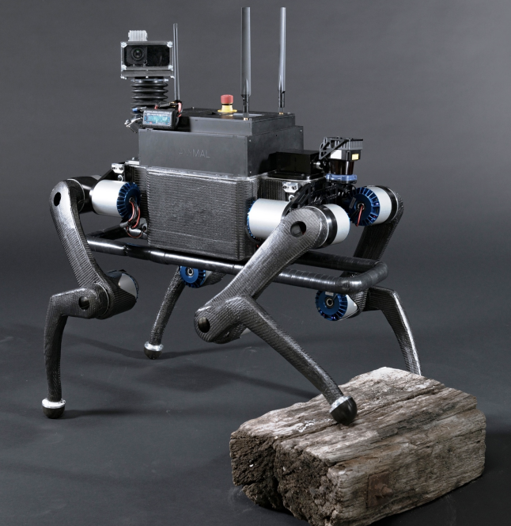

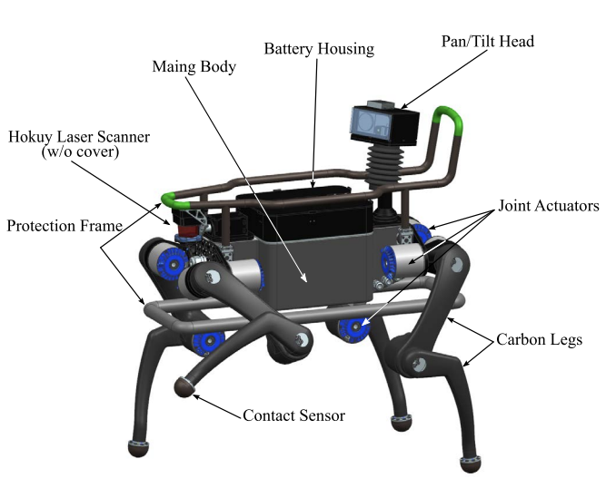

​	ANYmal, a highly mobile and rugged quadrupedal platform developed for autonomous operation in challenging environments. ANYmal was designed to combine outstanding mobility with dynamic motion capability that enables it to climb large obstacles as well as to dynamically run. This completely autonomous machine paves the road for real world applications. It is in use for the NCCR Search and Rescue grand challenge as well as in the ARGOS oil and gas site inspection challenge - both scenarios with very harsh and demanding environments. 

***

##### Keep Rollin' - Whole-Body Motion Control and Planning for Wheeled Quadrupedal Robots

- RAL 2019 Jan  
- paper link: https://arxiv.org/abs/1809.03557
  - Robotic Systems Lab, ETH Zurich, 8092 Zurich, Switzerland
- overview:

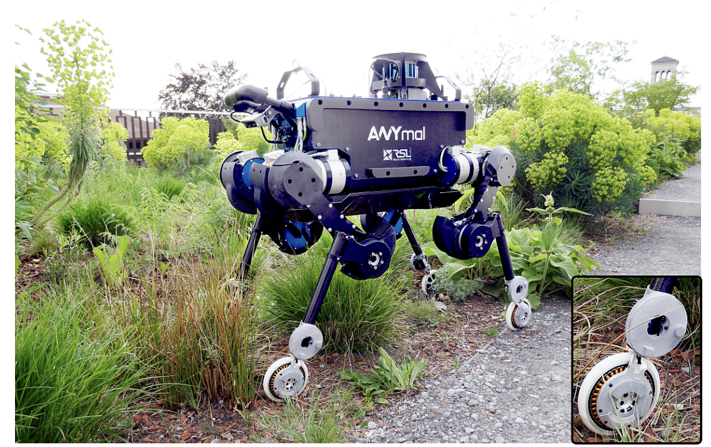

​	The fully torque-controlled quadrupedal robot ANYmal is equipped with four non-steerable, torque-controlled wheels. Thus, the number of actuated joint coordinates nτ and the number of joints nj are both equal to 16. A video demonstrating the results can be found at https://youtu.be/nGLUsyx9Vvc

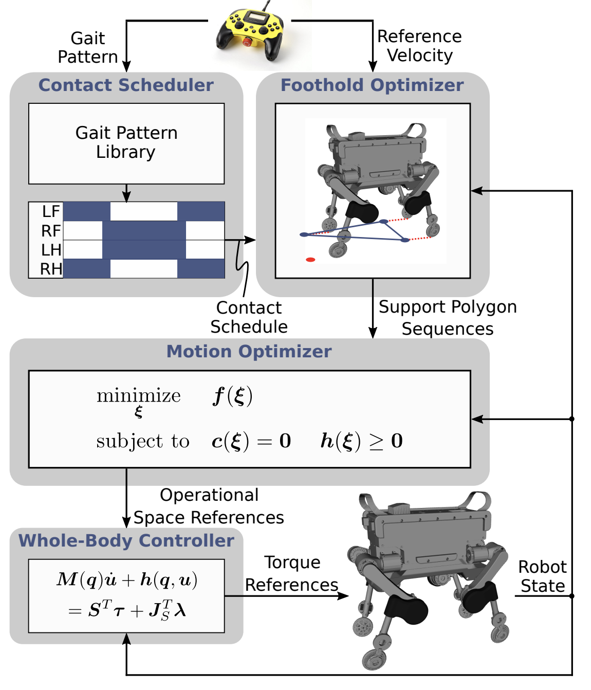

​	The motion planner is based on a 3D ZMP approach which takes into account the support polygon sequence and the state of the robot. The hierarchical WBC which optimizes the whole-body accelerations and contact forces tracks the operational space references. Finally, torque references are sent to the robot. 

***

##### Ascento: A Two-Wheeled Jumping Robot

-  ICAR 2019 May
- paper link: https://arxiv.org/abs/2005.11435
  - Autonomous Systems Lab, ETH Zurich, Switzerland
- overview: 

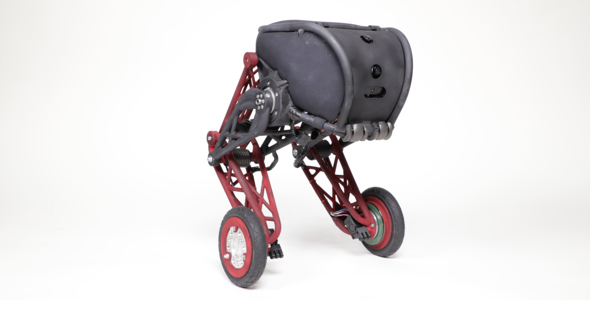

prototype of the Ascento robot

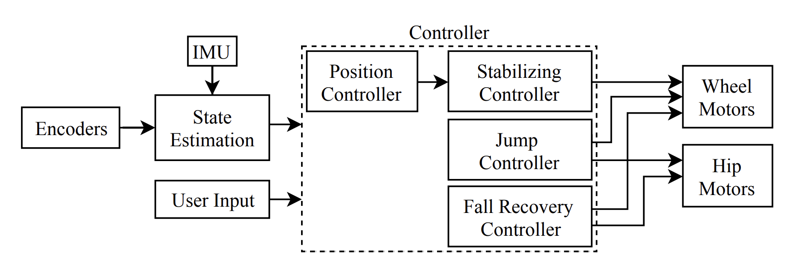

ascento controller architecture
 

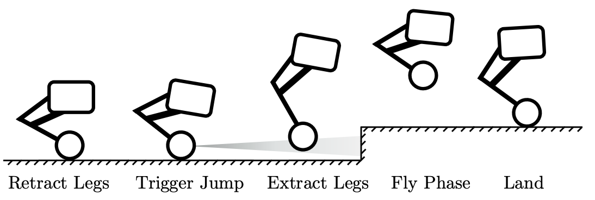

discrete phases of the jump sequence. In each phase a different control strategy is applied

- main contribution:
  - Design of a two-wheeled balancing robot with a parallel elastic jumping mechanism;
  - Designed a controller based on LQR and segmented control;
  - Successful experimental verification and evaluation of an actual prototype.

***

##### LQR-Assisted Whole-Body Control of a Wheeled Bipedal Robot With Kinematic Loops

- IEEE RAL 2020 March 
- paper link: https://ieeexplore.ieee.org/abstract/document/9028180
  - ASL,ETH Ziirich, 8092 Zurich,Switzerland
  - CRL, Department of Computer Science, ETH Zurich,8092 Zurich,Switzerland
- overview:

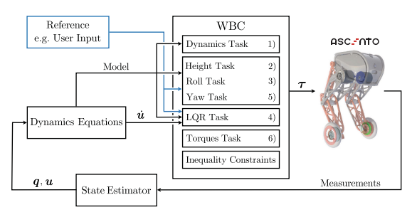

​	Block diagram of the control pipeline running on the robot.

***

##### Trajectory Optimization for Wheeled-Legged Quadrupedal Robots Driving in Challenging Terrain

- IEEE RAL 2020 April
- paper link: https://ieeexplore.ieee.org/abstract/document/9079567
  - Mechanical Engineering Department, PUC-Rio, Rio de Janeiro, Brazil
  - Robotic Systems Lab, ETH Zürich, Zürich, Switzerland
- overview:

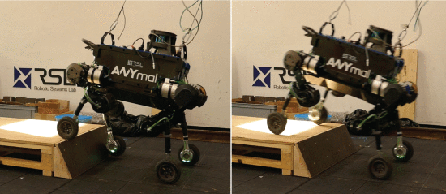

​	The quadrupedal robot ANYmal equipped with four non-steerable, torque-controlled wheels, driving up a step 0.2 m high (over 40% of the legs length) and a 65∘ slope using the TO framework.

- main contribution:

  ​	The authors aim to bridge the gap between fast motions and motions in rough terrain. 

  ​	Their planning and control setup breaks the navigation in rough terrain problem into two subproblems: terrain aware motion planning and perceptive whole-body control. By adding the offline planning component, they are able to execute faster motions over steep steps compared to previous approaches. The algorithm is a TO framework for wheeled-legged robots that optimizes over the 6D base motion (position and orientation) as well as the wheels’ positions and contact forces in a single planning problem, accounting for the terrain map and the robot's dynamics. This allows the robot to traverse a variety of challenging terrain, including large steps and drops, with dynamic driving motions that could not be generated without taking into account the terrain information. 

  ​	Moreover, the approach is general for all terrain types and the robot's base is not restricted to a desired height or orientation, which expands the range of achievable motions, especially for more complex terrains. 

  ​	Furthermore, they evaluated the proposed approach on ANYmal equipped with actuated non-steerable wheels in both simulations and real-world experiments. They show that ANYmal is able to traverse a variety of terrains, including steep inclinations 0.2 m high with 45∘ and 65∘ slopes at an average speed of 0.5 ms−1 and a maximum speed of 0.9 ms−1, which is over three times faster than previous approaches. 

***

##### Sim-to-Real Learning of All Common Bipedal Gaits via Periodic Reward Composition

- IEEE ICRA 2020 November 
- paper link: https://arxiv.org/abs/2011.01387
  - Oregon State University
- overview:

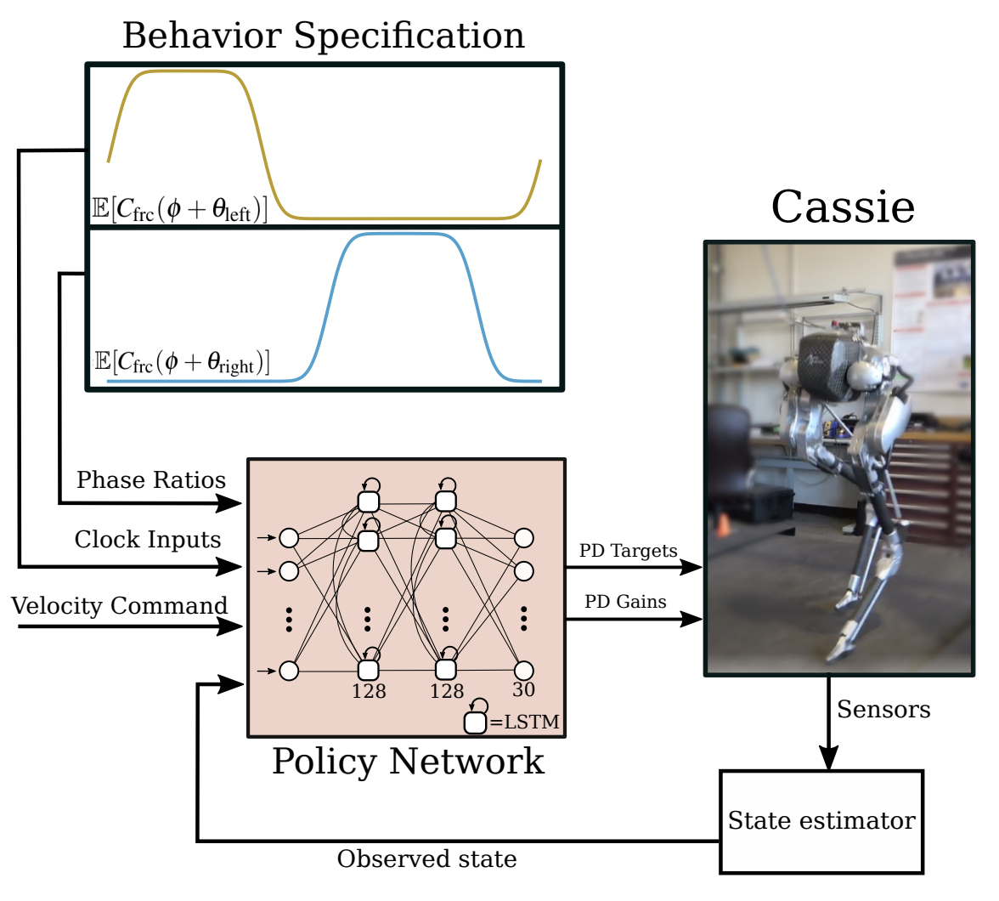

​	This paper present a reward design framework which makes it easy to learn policies which can stand, walk, run, gallop, hop, and skip on hardware. We condition the reward function based on a number of gait parameters, and also provide these parameters to the LSTM policy, which outputs PD joint position targets and PD gains to the robot.

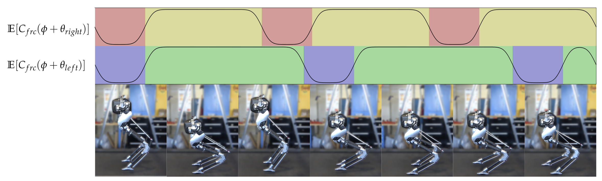

​	A series of images showing a neural network policy controlling Cassie and continuously transitioning from hopping to galloping to walking. We present a simple reward design paradigm which makes use of probabilistic intervals to apply cost functions at specific times, allowing policies to learn all common bipedal gaits exhibited by animals in nature.

***

##### Underactuated Motion Planning and Control for Jumping With Wheeled Bipedal Robots

- IEEE RAL 2020 December 
- paper link: https://ieeexplore.ieee.org/abstract/document/9310341
  - Department of Mechanical and Energy Engineering, Southern University of Science and Technology, Shenzhen, China
- overview:

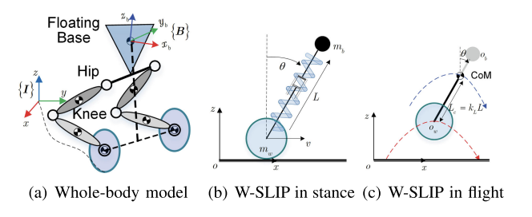

​	Whole-body model and proposed W-SLIP(a novel wheeled-spring-loaded inverted pendulum) model. 

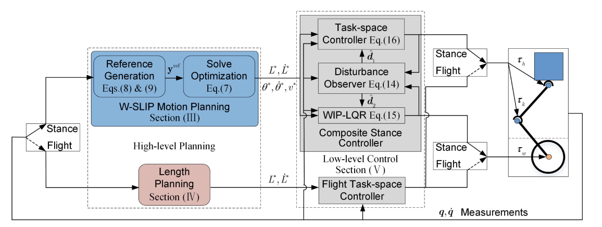

​	Overall planning and control architecture proposed in this letter. Blocks shaded in blue run at 25 Hz, blocks shaded in gray run at 500 Hz, block shaded in red runs only once at the take-off moment.

***

##### Balance Control of a Novel Wheel-legged Robot: Design and Experiments

- IEEE ICRA 2021 May
- paper link: https://ieeexplore.ieee.org/abstract/document/9561579
  - Tencent Robotics X
  - Control and Networks Lab, New York University
  - Department of Electrical & Electronic Engineering, School of Engineering, University of Manchester
- main contribution:
  1. To balance the novel-designed wheellegged robot, the nonlinear controller IDA-PBC for the position regulation problem in the past literature is redesigned for the velocity tracking problem. The nonlinear controller is implemented in practice, and various experiments validate the stability and robustness of the controller
  2. For the problem when the equilibrium pitch angle is unknown, linear output regulation is applied to regulate the robot stand still, and is tested in the experiment.

***

##### Learning-Based Balance Control of Wheel-Legged Robots

- IEEE RAL 2021 July
- paper link: https://ieeexplore.ieee.org/abstract/document/9497675
  - Tencent Robotics X
  - Control and Networks Lab, New York University
  - Department of Electrical & Electronic Engineering, School of Engineering, University of Manchester
- overview:

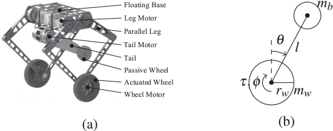

​	(a) Mechanical structure of the wheel-legged robot. 

​	(b) Template model of the robot.

- main contribution:
  1) Based on RL and ADP techniques, a data-driven VI algorithm is proposed to generate a near-optimal balance controller in the absence of the accurate dynamics of the wheel-legged robot. The first application of the learning-based control method for the balance of wheel-legged robots with experimental validations. 
  2)  The convergence of the data-driven VI algorithm and the stability of the robot in closed-loop with the adaptive optimal controller are theoretically analyzed. 
  3) sUnder different circumstances, physical experiments are conducted to validate the effectiveness and robustness of the learned optimal controller.

***

##### Whole-Body MPC and Online Gait Sequence Generation for Wheeled-Legged Robots

- IEEE RSJ 2021 September 
- paper link: https://arxiv.org/abs/2010.06322
  - Robotic Systems Lab, ETH Zürich, 8092 Zürich, Switzerland
- overview:

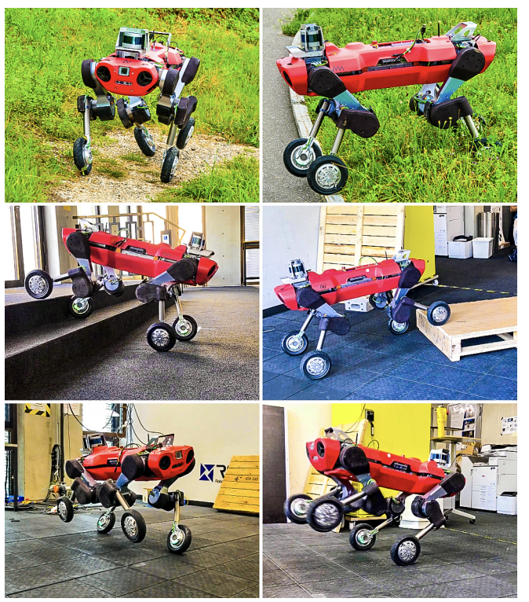

​	 With the novel whole-body MPC, the robot ANYmal, equipped with actuated wheels, explores indoor and outdoor environments in a fast and versatile way (video available at https://youtu.be/_rPvKlvyw2w). 

​	First row: Locomotion in high grass and over steep hills of up to 2 m/s, while gait sequences are automatically discovered. 

​	Second row: Blindly stepping over a 0.20 m high step (32 % of leg length) and stairs with a 0.175 m high step (28 % of leg length). Third row: Pacing gait and 0.28 m high jump with front legs.

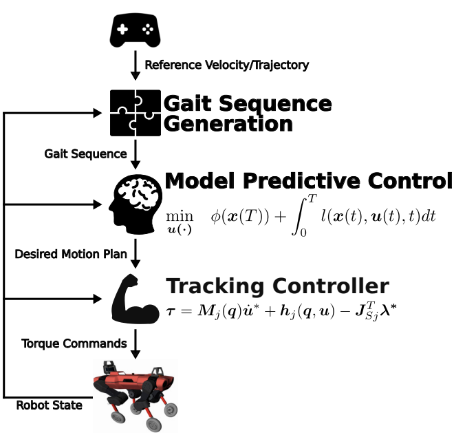

​	Overview of the locomotion controller. The gait sequence generator automatically transforms reference trajectories from a higher-level planner or operator device into lift-off and touch-down sequences. These gait sequences are fed into the MPC that optimizes joint velocities and contact forces over a time horizon T. Finally, a tracking controller, e.g., , transforms the desired motion plan into torque references τ.

***

##### A fuzzy LQR PID control for a two-legged wheel robot with uncertainties and variant height

- JRC 2023 
- paper link: https://journal.umy.ac.id/index.php/jrc/article/view/19448/8570

  - Department of Automation Control, Ho Chi Minh City University of Technology and Education, Vietnam

  - Faculty of Mechanical Engineering, Ho Chi Minh City University of Technology, Vietnam
- main contribution:

  1. A proposed control is constructed based on the fuzzy  supervisor and three LQR controllers which are  respectively designed according to three postures of the  TLWR, low, medium and high postures. As a result, the  complexity in the TLWR is reduced in the control design. 
  2. The effectiveness of the proposed control is verified on a  practical testbench and the challenges, measuring the  robotic height and compensating angles for the pitch  angle in the real testbench, are also discussed in this  paper.

***

##### Reinforcement Learning for Blind Stair Climbing with Legged and Wheeled-Legged Robots

- IEEE  ICRA 2024 February 

- paper link: https://arxiv.org/abs/2402.06143
  - Department of Computer and Software Engineering, Ecole Polytech- ´ nique de Montreal, 2900 Boul. ´ Edouard-Montpetit, Qu ´ ebec, Canada
  - Autonomous Systems Lab, ETH Zurich, Switzerland.
  - Robotic Systems Lab, ETH Zurich, Switzerland.
  - Ascento Robotics, Zurich, Switzerland
- overview:

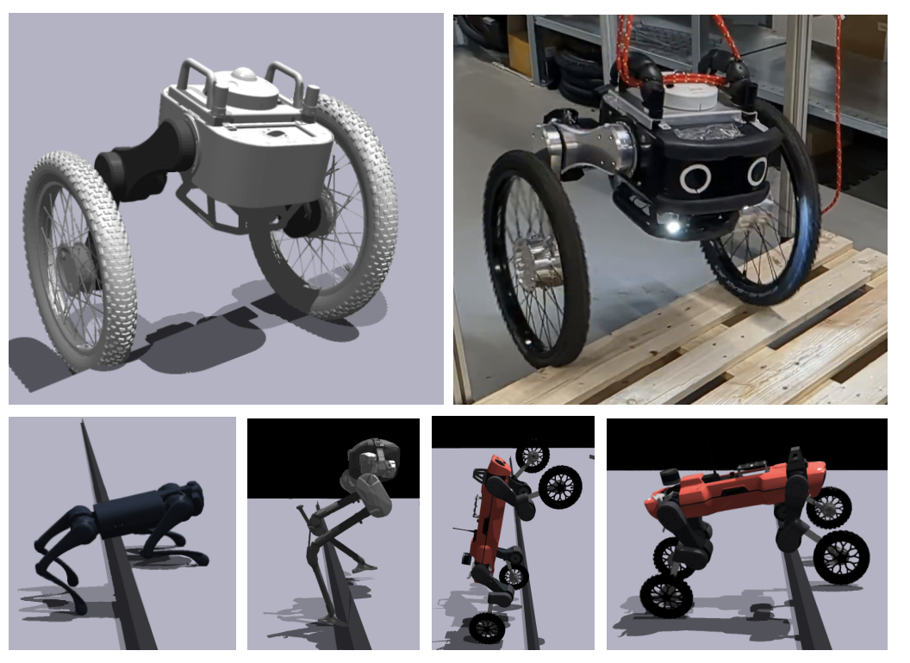

​	Proposed Method: Ascento Robot, Unitree Go1, Cassie and ANYmal on Wheels climbing steps.

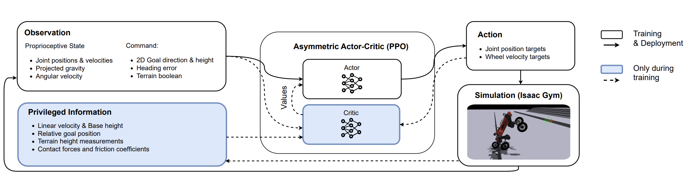

​	System Overview during Training and Deployment: At every training step, the algorithm receives the observation and privileged information. The actor outputs an action for the next simulation step. During deployment, the actor receives only the observation and outputs an action for the robot to execute.

***

##### Learning Robust Autonomous Navigation and Locomotion for Wheeled-Legged Robots

- Science Robotics 2024 May
- paper link: https://arxiv.org/pdf/2405.01792
  - Robotic Systems Lab, ETH Zurich, Zurich, Switzerland
  - Neuromeka, Seoul, Korea
  - Swiss-Mile Robotics AG, Zurich, Switzerland
- overview: 

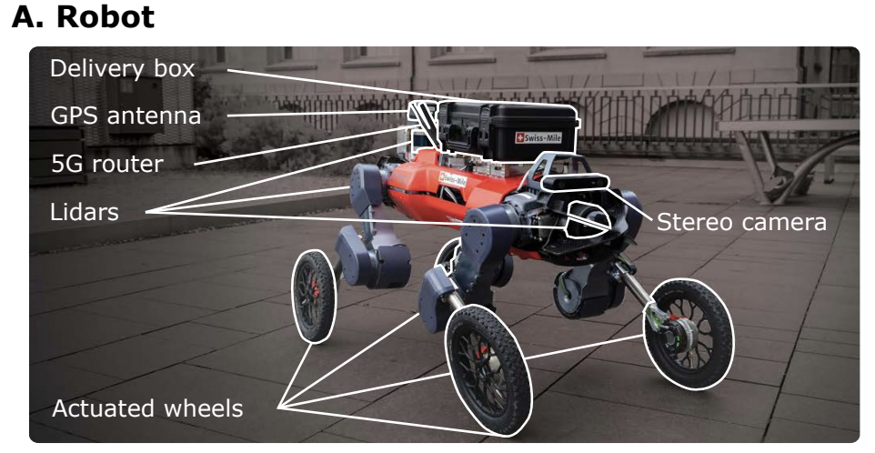

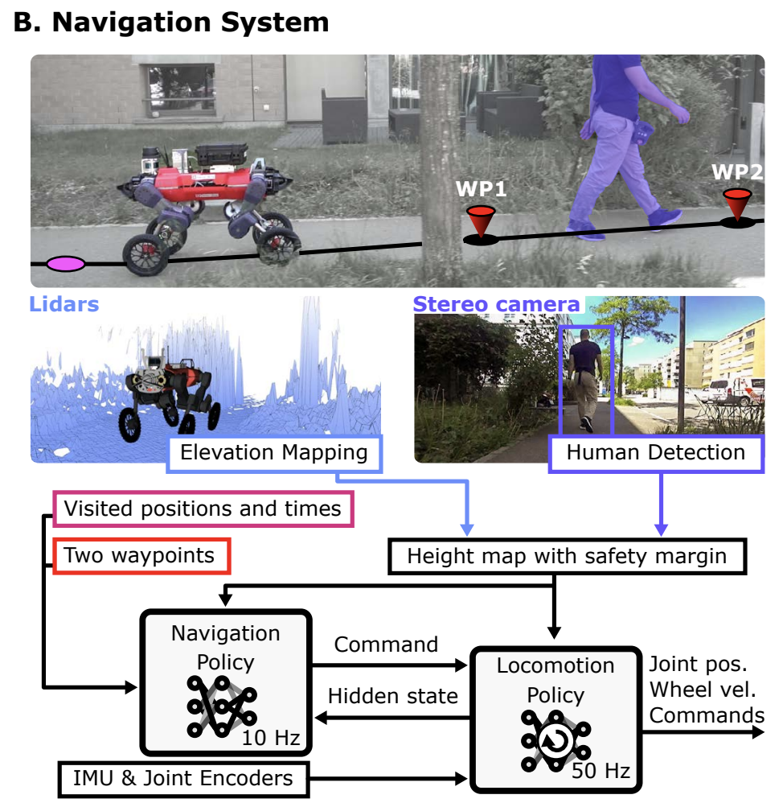

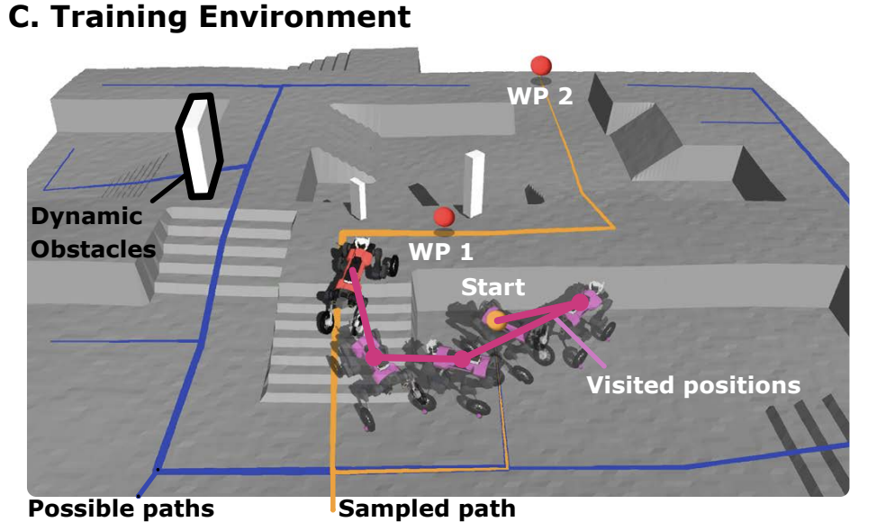

​	(A) This wheeled-legged quadrupedal robot is equipped with various payloads for onboard terrain mapping, obstacle detection, and localization. (B) Overview of the navigation system. The system is driven by two neural network policies operating at different levels. The high-level navigation policy observes two waypoints (WP 1 and WP 2) and generates target velocity commands for the locomotion policy. The low-level locomotion policy then controls joint actuators and follows the velocity commands. (C) The training environment is designed to dynamically generate new navigation paths for each episode, optimizing the learning process. By leveraging pre-generated obstacle-free paths, we enhance the navigation capabilities of our system.

***

## Manipulation

##### Visual Whole-Body Control for Legged Loco-Manipulation

- CoRL 2024 March
- paper link: https://arxiv.org/abs/2403.16967
  - UC San Diego
- homepage: https://wholebody-b1.github.io/

***

